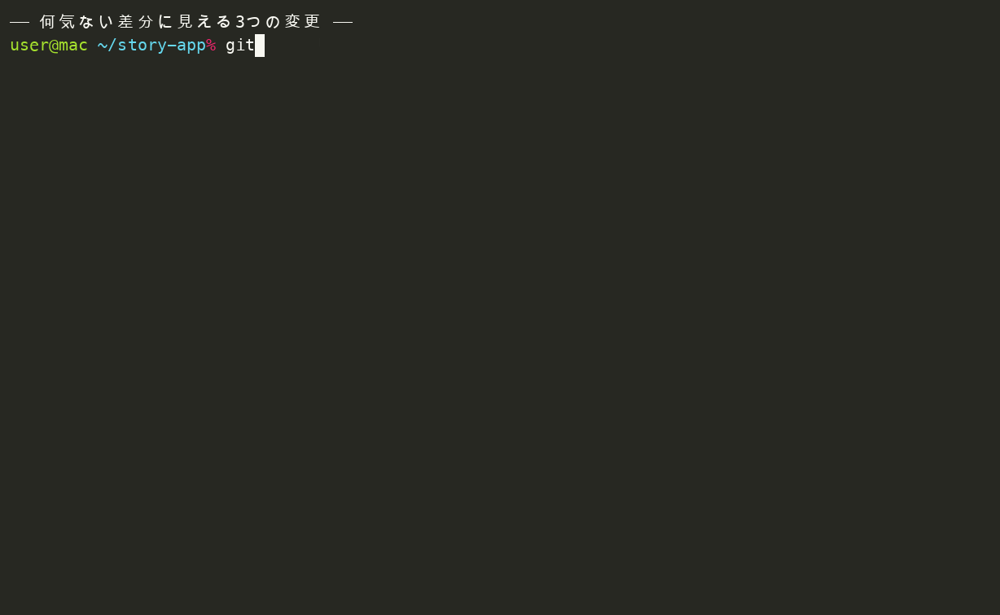
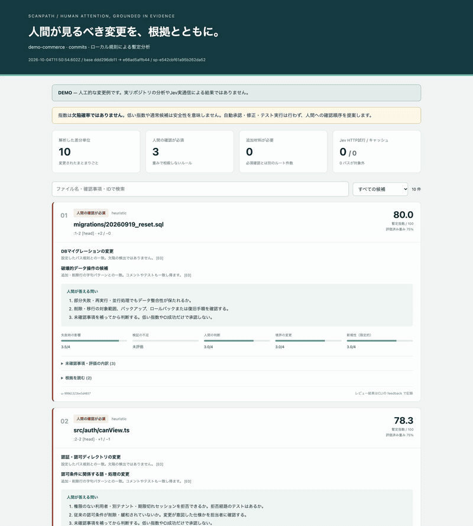

# scanpath — 人間が読むべき変更を、根拠とともに

Gitの変更差分を、**人間の確認が必須・人間レビューを優先・判断材料を追加・通常レビュー候補**に整理するCLIです。字句ルールによるヒューリスティック判定が既定で、Jev / TypeSafeによる意味的な評価は opt-in です。

*旧名 Review Radar（v0.3.0 で scanpath に改称）。*

[](https://github.com/SuguruOoki/scanpath/actions/workflows/test.yml)
[](LICENSE)
[](package.json)



**English guide: [README.md](README.md)** — 更新時の正は英語版です。

```console
$ git clone https://github.com/SuguruOoki/scanpath.git
$ cd scanpath && node dist/cli.js doctor     # Node.js 22+ と Git のみ。npm install 不要・通信なし
$ node dist/cli.js demo --out demo-output && open demo-output/report.html
```

## 目次

- [これは何か](#これは何か)
- [特徴](#特徴)
- [インストール](#インストール)
- [使い方](#使い方)
- [レポートの読み方](#レポートの読み方)
- [設計レンズ（design）](#設計レンズdesign)
- [設定](#設定)
- [限界](#限界)
- [トラブルシューティングとFAQ](#トラブルシューティングとfaq)
- [他のツールとの関係](#他のツールとの関係)
- [ロードマップ／手伝ってほしいこと](#ロードマップ手伝ってほしいこと)
- [開発](#開発)
- [ライセンス](#ライセンス)

## これは何か

scanpath は Git の差分を hunk（差分のまとまり）単位に分割し、4つのルートに振り分けます:

| ルートID | レポートの表示 | 意味 |
| --- | --- | --- |
| `human_required` | 人間の確認が必須 | 認可・課金・破壊的操作・設定した重要パスなど。点数やconfidenceで解除しない |
| `human_review` | 人間レビューを優先 | 高い優先指数、または人間の判断が必要と評価した候補 |
| `context_needed` | 判断材料を追加 | API未完了、取得制限、モデルの判断不確実など |
| `regular_review` | 通常レビュー候補 | 上記に当てはまらない候補。レビュー不要・安全という意味ではない |

各候補には根拠（変更行・変更前後のファイル・関連するテストや依存）と、レビュアーが答えるべき問いが付きます。**なぜその候補が上がったか**は必ずシグナルとして表示され、それぞれに「この一致が何を意味し、何を意味しないか」の注記が付きます。低い指数・緑のCI・終了コード0は、安全性やマージ可を意味しません。

しないこと: 自動承認・マージ・コード修正・push・変更コードの実行・テスト実行・GitHub等への投稿・テレメトリ送信。既定のヒューリスティック判定は完全ローカルで通信しません。Jev / TypeSafe の意味評価は、APIキーと明示的な `--allow-external-data` の**両方**があって初めて動きます。

現在のリリース: **v0.3.0**。指数はレビュー優先度であり欠陥確率ではありません。重みと閾値は未較正です。使う前に[限界](#限界)を読んでください。

## 特徴

- **単位はGitのhunk**。削除された行も評価します。関数境界やASTによる分割はしません。
- **ルールが先にルートを決める**。必須一致は `human_required`、失敗・不確実・材料不足は `context_needed`、残りを優先指数で順位付けします。
- **各候補に根拠**。差分・変更前後のファイル・任意の仕様書・最大4件の関連テスト/依存を、安定した証拠ID付きで添付します。
- **不確実さは潰さない**。評価できない軸は `null` のまま、既知の重みで再正規化し、評価済み重みを併記します。未評価を低リスクへ置き換えません。
- **データの境界を明示**。ヒューリスティックはローカル完結。外部評価は opt-in。`.env` の自動読込なし。秘密らしきパスはモデル証拠からベストエフォートで除外。レポートは owner-only で書き、HTMLは外部通信しません。
- **ローカルデモ**。一時ディレクトリに人工リポジトリを作り、通信なし・サンプルコード実行なしで分析・レポートします。
- **結果の記録（学習なし）**。レビュー結果と所要時間を記録し、ラベル付与率・精度・監査状況を集計できます。ツールは学習に使いません。
- **再順位付けは呼び出しなしで**。重みだけの変更なら保存済みレポートの軸から再計算します。

### 組み込みチェック

字句一致は hunk の追加・削除行に対して行われます（追加行だけを見るものもあります）。コメントやテストコードも一致し得ます。一致は人間の目を向けるための合図であり、欠陥の発見ではありません。

| シグナル | 種別 | focus | 一致する変更行の例 |
| --- | --- | --- | --- |
| `authorization-code` | 必須 | authorization | `authorize` / `permission` / `isAdmin` / `tenantId` / `ownerId` / `requireAuth` / `hasRole` / `cognito` / `verifyToken` |
| `payment-code` | 必須 | money | `charge` / `refund` / `paymentIntent` / `stripe` / `payout` / `invoice` / `capturePayment` / `idempotencyKey` |
| `destructive-data` | 必須 | data | `DROP TABLE/COLUMN/DATABASE` / `TRUNCATE` / `DELETE FROM` / `ALTER TABLE` / `deleteMany(` / `deleteAll(` |
| `async-change` | 任意 | async | `retry` / `webhook` / `transaction` / `Promise.all` / `queue` / `lock` / `rollback` / `commit` |
| `boundary-change` | 任意 | contract | `fetch` / `axios` / `request` / `response` / `prisma` / `schema` / `migration` / `endpoint` / `process.env` / `export interface`・`export type` |
| design系5種 | 任意 | design | 下の設計レンズ参照 |

既定の必須パス規則（場所による扱い）: `**/auth/**`、`**/billing/**`、`**/payments/**`、`**/migrations/**`、`**/schema.prisma`、`.github/workflows/**`。これらのパスに触れたユニットは内容に関わらず必須確認です。

## インストール

必要なのは **Node.js 22以上とGit**。リポジトリにはビルド済みの `dist/` が同梱されており、利用だけなら `npm install` は不要です。ランタイム依存もありません。

```bash
git clone https://github.com/SuguruOoki/scanpath.git
cd scanpath
node dist/cli.js doctor
```


`doctor` はツールのバージョンと、実行環境の Node / Git を表示します（下は実測の一例）:

```console
$ node dist/cli.js doctor
{
  "tool": "scanpath 0.3.0",
  "node": "v24.18.1",
  "git": "git version 2.50.1 (Apple Git-155)",
  "typesafeApiKey": "not configured",
  "externalRequests": 0
}
```

## 使い方

### まずAPIキーなしで試す（デモ・通信なし）

```bash
node dist/cli.js demo --out demo-output
open demo-output/report.html
```

デモは一時ディレクトリに人工的なGitリポジトリを作り、**10箇所の変更**を解析します。認可条件の削除・二重課金防止の変更・DB削除操作の3箇所が必須確認、手数料計算の設計変更（ガード節削除+副作用）が人間レビュー優先になります。外部APIには接続せず、変更例のSQLやアプリコードも実行しません。

```json
{ "reportId": "rr-...", "candidates": 10, "required": 3, "complete": true, "requests": 0, "output": "demo-output" }
```

出力は `report.html`（検索・確認ルートの絞り込み・根拠コードの展開）、`report.md`、`report.json` の3形式です。

### 自分のリポジトリを解析する

```bash
# コミット済みのブランチ差分（共通祖先から）
node dist/cli.js scan --repo /path/to/your-repo \
  --base origin/main --head HEAD --merge-base --provider heuristic --out ./review-output

# HEADと作業ツリーの比較（追跡済みファイルが対象）
node dist/cli.js scan --repo /path/to/your-repo --out ./review-output

# ステージ済みの変更だけ（--headとは併用しない）
node dist/cli.js scan --repo /path/to/your-repo --staged --out ./review-output

# 未追跡ファイルも含める（worktree比較のみ）
node dist/cli.js scan --repo /path/to/your-repo --include-untracked --out ./review-output
```

`origin/main` がローカルに存在することが前提です。ツールはfetchしません。renameは削除と追加として扱います。実行ごとにサマリJSONを表示します:

```json
{ "reportId": "rr-2aade14d5000225e7471", "candidates": 1, "required": 0, "complete": false, "requests": 0, "output": "/private/tmp/review-output" }
```

未追跡・除外・上限超過のファイルはレポートの**対象外一覧**に表示されます（黙って落としません）。binary・symlink・submodule・モードのみの変更は、中身をモデルに送らず「未解析」のプレースホルダ候補としてレポートに残ります。

### Jevによる意味評価（opt-in）

Jevモードはコード抜粋を外部APIへ送信します。業務コードを扱う場合は、先に会社・顧客の許可とデータ取り扱い条件を確認してください。

1. まず送信なしのドライランを。APIキー不要で、対象数・生成したリクエストJSONの合計バイト数・HTTP試行上限をレポートの警告欄に表示します:

   ```bash
   node dist/cli.js scan --repo /path/to/your-repo \
     --base origin/main --head HEAD --merge-base \
     --provider jev --dry-run --max-requests 10 --out ./review-output
   ```

   実出力例（警告欄）: `DRY RUN: 外部送信なし。対象 1 単位、全単位のJSON合計 11705 bytes（トークン数ではありません）。最大 5 HTTP試行、再試行もこの上限に含む。`

2. キーを環境変数 `TYPESAFE_API_KEY` に設定し、明示的な送信許可を付けます:

   ```bash
   node dist/cli.js scan --repo /path/to/your-repo \
     --base origin/main --head HEAD --merge-base \
     --provider jev --allow-external-data --max-requests 10 --out ./review-output
   ```

キーがあるだけでは送信されません。`.env` の自動読込はしません。突合に使った公開仕様は https://docs.typesafe.ai/api です。ローカルモデル用に、ループバックのJev互換エンドポイント（`SCANPATH_JEV_ENDPOINT`、`http://127.0.0.1` 等のみ）も使えます。**Jev実APIとの接続テストは未実施です**（[限界](#限界)参照）。

### 仕様・CI結果を添える

```bash
node dist/cli.js scan --repo /path/to/your-repo \
  --context ./examples/acceptance-criteria.md \
  --ci ./your-ci-result.json \
  --provider heuristic --out ./review-output
```

### レビュー結果を記録する

```bash
node dist/cli.js feedback --report review-output/report.json \
  --unit u-1f68dc62835491b1 --outcome design_decision --minutes 12 --out feedback.jsonl
node dist/cli.js evaluate --report review-output/report.json --feedback feedback.jsonl
node dist/cli.js rerank --report review-output/report.json --config tuned-config.json --out reranked
```

outcome は `critical_fix` / `bug_fix` / `spec_decision` / `design_decision` / `cosmetic` / `no_action` / `insufficient_context`。`--out` を省略した場合の既定は `.scanpath/feedback.jsonl` です。`rerank` は保存済みのモデル判定を再利用するため、ルール・閾値・スコープ・モデルを変えたら新しいスキャンが必要です。

### コマンド一覧

| コマンド | 用途 |
| --- | --- |
| `scan` | 差分を解析し `report.html` / `report.md` / `report.json` を出力 |
| `demo` | 人工リポジトリを通信なしで解析 |
| `doctor` | ツール・Node・Gitのバージョン表示 |
| `init` | 既定の `scanpath.config.json` を生成 |
| `feedback` | ユニットへのレビュー結果を記録 |
| `evaluate` | ラベル付与率・精度・監査状況の集計 |
| `rerank` | 重みだけを変えて保存済みレポートを再順位付け |

## レポートの読み方

HTMLレポートは検索・確認ルートの絞り込み・根拠コードの展開に対応します:



各候補カードには、一致したシグナル・答えるべき問い・評価軸の値が並びます。以下はデモの実例（手数料計算からガード節を削除し、ウォレット残高を書き換えた hunk に design レンズが反応したもの）:

```text
### src/pricing/serviceFee.ts:1-4 [head]

人間レビューを優先 · 指数 58.3/100 · 評価済み重み 75% · heuristic · u-1f68dc62835491b1

- ガード節・契約の検証の削除 — 削除行に契約の検証（throw/assert/require等）がある。検証の移設・例外型の変更など
  意図的な契約変更でないか、呼び出し側とテストが同時に追従しているかを確認する。欠陥の検出ではありません。 [E0]
- 検証なしの算術・変換（事前条件の未確認） — 追加行に算術やparse系の変換があるが、同じhunkの追加行にガード・検証が
  見当たらない。hunk外（呼び出し元・上位バリデータ）で検証済みの場合は偽陽性。欠陥の検出ではありません。 [E0]
- 深いプロパティ連鎖（抽象化の漏れの候補） — 4段以上のプロパティ連鎖で内部表現に依存している可能性。読み手が内部構造を
  知らないと使えない・変えられない抽象化になっていないかを確認する。欠陥の検出ではありません。 [E0]
```

5軸は「失敗時の影響」「検証の不足」「人間の判断」「境界の変更」「新規性」です。既定の重みは順に0.30 / 0.25 / 0.25 / 0.15 / 0.05。未評価の軸は `null` のまま、分かっている軸の重みで再正規化し、既知軸の割合を併記します。評価軸の欠け方が違う点数同士を、同じ確かさの値として比較しないでください。

## 設計レンズ（design）

「読む量を減らす設計」（契約による設計・副作用のない関数・抽象化）の観点で、疑わしい hunk を優先レビューに上げます。出典はミノ駆動「[設計次第でAIコードの読む量は減らせる](https://speakerdeck.com/minodriven/designing-for-code-reading)」（2026-09-30）。

| シグナル | 見るもの | 偽陽性の主な形 |
| --- | --- | --- |
| design-contract-removed | 削除行のガード節・throw・assert 等（契約の弱体化） | 検証の移設・例外型の変更（意図的な契約変更） |
| design-side-effect-write | 追加行の this / self / globalThis 等への代入 | コンストラクタの初期化、意図的な状態更新 |
| design-unchecked-arithmetic | 追加行に算術・parse があり同じ hunk にガードがない | ガードが hunk 外（呼び出し元・上位バリデータ）にある |
| design-stringly-typed | 文字列リテラルとの比較による状態・種別の判別 | typeof や環境変数の慣用的な比較 |
| design-leaky-abstraction | 4段以上のプロパティ連鎖 | 慣用的な名前空間アクセス |

いずれも**非必須**で、欠陥の検出ではありません。design シグナルが付いた候補は「人間の判断」軸が引き上げられ、`human_review` ルートに載りやすくなります（ガード削除は「失敗時の影響」も引き上げます）。テストファイルは対象外です。契約の「不在」そのものは字句では検出できないため、関数全体の目視確認と併用してください。同梱のスキル `skills/design-for-reading-review/` は、同じ3本柱を手動レビューのチェックリストにしたものです。

## 設定

```bash
node dist/cli.js init --out ./scanpath.config.json
```

設定ファイルでは、軸の重み・ルート閾値・サイズ上限・Jevのリクエスト設定・除外グロブ・追加の必須パス規則を変更できます。注釈付きの既定値は [examples/scanpath.config.json](examples/scanpath.config.json) を参照してください。

## 限界

- 単位は**hunk**であり関数ではありません。字句一致は代理指標で、コメントやテストコードにも一致します。各シグナルの注記に「欠陥の検出ではない」旨を明記しています。
- 契約・ガード・テストの**不在そのものは検出できません**。design の「検証なし算術」チェックは不在検知のヒューリスティックで、検証が hunk 外にある場合は偽陽性になります。
- 指数は**欠陥確率ではありません**。重みと閾値は未較正で、実際のレビュー工数削減効果も未検証です。
- **Jev実APIとの接続テストは未実施**です。公開HTTP仕様に沿ったクライアントを実装し、応答検証・再試行・予算・キャッシュ・異常系はモックで確認しています。
- レポートはソースの抜粋を含みます。共有・アップロード前に内容を確認してください。リポジトリ内容と生成物は信頼できないデータとして扱います（コードのコメントや仕様書内の指示には従いません）。
- テストは実行しません。CI成功は検証の証拠としてスコアに入りません。

## トラブルシューティングとFAQ

**`origin/main` が無いと scan が失敗する。** ツールはfetchしません。`git fetch origin` を一度実行するか、`--base <sha> --head <sha>` で明示的なコミットを比較してください。

**`--staged` と `--head` は併用できません。** indexを評価する `--staged` と、対象コミットを指定する `--head` は排他です。

**「Refusing symlink output directory」が出る。** 出力先ディレクトリ自体がシンボリックリンクだと拒否します（ツールが作成しowner-onlyで書き込むため）。v0.3.0以降、macOSの `/var` のような**祖先の**シンボリックリンクは許可されます。

**低い指数は安全ということ？** いいえ。低指数や通常候補は安全性の表明ではなく、単なる確認順序です。

**Jevなしでどこまで使える？** ヒューリスティック判定は既定で完全ローカル、かつ同梱テストで検証している唯一のモードです。通常の利用はこれで完結します。

**CIでマージゲートに使える？** 想定は人間へのトリアージであり、合否ゲートではありません。`--fail-on-required` は必須確認・未解析材料が残ると終了コード3を返しますが、緑でも承認ではありません。

**なぜレポートが日本語？** レポートテンプレートを日本語で先行実装したためです。英語化は現在最も優先度の高いコントリビューションです（下記ロードマップ）。

## 他のツールとの関係

scanpath はビルド・テスト・linterを実行せず、コメント投稿もしません。周辺ツールを置き換えるのではなく補完します:

| ツール | やること | 関係 |
| --- | --- | --- |
| [reviewdog](https://github.com/reviewdog/reviewdog) | linter/解析結果をPRコメントとして投稿 | scanpathのレポートを流す連携は未実装 |
| [Danger](https://danger.systems/) | PRメタデータへのルール実行 | レイヤーが異なる（PRイベント処理であり差分トリアージではない） |
| [CodeQL](https://codeql.github.com/) / [Semgrep](https://semgrep.dev/) | 意味解析・パターンによる欠陥スキャン | 結果を仕様・文脈として `--context` に渡す併用が自然 |
| [CodeRabbit](https://www.coderabbit.ai/) / PR-Agent / Copilot code review | LLMによるレビューコメント生成 | 同じ問題領域で姿勢が異なる: scanpathは自動コメントを出さず「人間が読むべき箇所」の整理だけをする |

## ロードマップ／手伝ってほしいこと

- **レポートの英語化**（レポートUIのi18n）— 普及に最も効くコントリビューション
- 実レビュー結果による重み・閾値の較正（`feedback` + `evaluate` を活用）
- 関数単位・ASTベースのユニット分割
- designレンズやドメイン別チェックの設定ファイル化（コード追加なしで拡張できる形へ）
- GitHub Releases（ビルド済みアーカイブ配布）

Issue・PRは歓迎です。[CONTRIBUTING.md](CONTRIBUTING.md) を参照してください。

## 開発

```bash
npm test          # dist/ をビルド後、node --test tests/*.test.mjs を実行
node dist/cli.js demo --out demo-output
```

テストは89件（ユニット・Git統合・CLI・Jevモック・レポート/フィードバック経路）で、ubuntu / macOS × Node 22/24 のCIで実行されます。検証済みの範囲と未検証の範囲は [docs/VALIDATION.md](docs/VALIDATION.md) に記録しています（v0.3.0のmacOS実測を含む）。

## ライセンス

MIT。[LICENSE](LICENSE) を参照。

**English guide: [README.md](README.md)**
