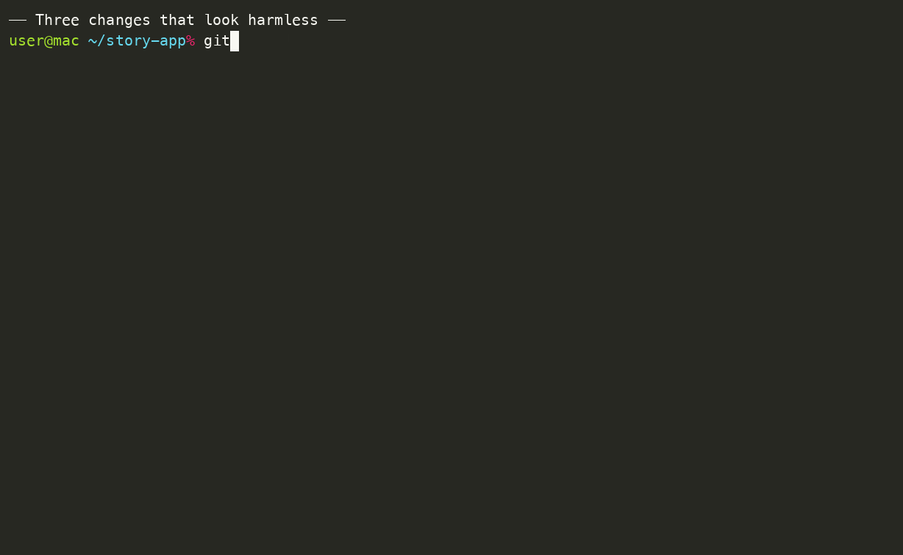

# scanpath

The reading path through a Git diff — which hunks a person should read first, with the evidence and the open questions attached.

*Formerly named Review Radar; renamed in v0.3.0.*

[](https://github.com/SuguruOoki/scanpath/actions/workflows/test.yml)
[](LICENSE)
[](package.json)



**Japanese guide: [README.ja.md](README.ja.md)**

```console
$ git clone https://github.com/SuguruOoki/scanpath.git
$ cd scanpath && node dist/cli.js doctor     # Node.js 22+ and Git. No npm install, no network.
$ node dist/cli.js demo --out demo-output && open demo-output/report.html
```

## Table of contents

- [What is scanpath?](#what-is-scanpath)
- [Features](#features)
- [Installation](#installation)
- [Usage](#usage)
- [Reading the report](#reading-the-report)
- [Configuration](#configuration)
- [Limitations](#limitations)
- [Troubleshooting and FAQ](#troubleshooting-and-faq)
- [Comparison with other tools](#comparison-with-other-tools)
- [Roadmap / Help wanted](#roadmap--help-wanted)
- [Development](#development)
- [License](#license)

## What is scanpath?

scanpath splits a Git diff into review units (Git hunks) and routes each unit to one of four buckets:

| Route id | English | Report label (Japanese) |
| --- | --- | --- |
| `human_required` | Human review required | 人間の確認が必須 |
| `human_review` | Human review priority | 人間レビューを優先 |
| `context_needed` | More context needed | 判断材料を追加 |
| `regular_review` | Regular review candidate | 通常レビュー候補 |

A unit that matches a mandatory rule (authorization, payment, destructive data, or a configured critical path) is always `human_required` — no score clears it. Units with failed, uncertain or context-blocked scoring go to `context_needed`. The rest go to `human_review` when the priority index is at least the threshold or the human-judgment axis is high, and to `regular_review` otherwise. `regular_review` does **not** mean the change is safe or needs no review.

Every candidate carries its evidence — the diff, the file before and after, and related test or dependency sources — plus the questions a reviewer should answer. Why a unit was surfaced is always printed as matched signals, each with a note that says what the match does and does not mean. A low index, a green CI badge and exit code 0 are never approval.

scanpath does **not**: approve or merge, edit code, push, execute the changed code, run tests or measure coverage, post to GitHub or any other service, or send telemetry. The default provider is local rules and makes no network requests at all. Semantic scoring through Jev / TypeSafe is opt-in and requires both an API key and an explicit `--allow-external-data` flag.

Current release: **v0.3.0**. Priority indexes are review priorities, not defect probabilities, and the weights and thresholds are uncalibrated. Read [Limitations](#limitations) before relying on the output.

## Features

- **Review units are Git hunks.** Each hunk is one unit, including removed lines. Function-level or AST-level splitting is not performed.
- **Rules decide the route first.** Mandatory matches go to `human_required`; failed, uncertain or context-blocked units go to `context_needed`; the rest are ranked by the priority index.
- **Evidence for every candidate.** The diff, the file before and after, an optional spec file, and up to 4 related test or dependency sources, each with a stable evidence ID.
- **Uncertainty is kept, not smoothed.** Axes that cannot be evaluated stay `null`; the index is renormalized over the evaluated weight and the evaluated weight is printed next to it. Unscored units are never downgraded to low risk.
- **Explicit data boundary.** Heuristic scoring is fully local. External scoring is opt-in, `.env` files are not read, secret-looking paths are kept out of model evidence with best-effort masking, reports are written owner-only, and the HTML report makes no external requests.
- **A local demo.** A synthetic repository is created in a temporary directory, analyzed and reported without any network access and without executing the sample code.
- **Recorded outcomes, no learning.** Reviewer outcomes and minutes can be logged and summarized (label coverage, precision among labeled top candidates, minutes, audit status). The tool does not train on them.
- **Reranking without new calls.** A weights-only change reorders a saved report from the stored axes.

### Built-in checks

Matching is lexical and runs over the added and removed lines of a hunk (some checks look at added lines only), so comments and test code in a diff can match too. A match is a prompt for a human look, not a finding of a defect.

| Signal | Kind | Focus | Matches changed lines containing |
| --- | --- | --- | --- |
| `authorization-code` | mandatory | authorization | `authorize`, `authorization`, `permission`, `isAdmin`, `tenantId`, `ownerId`, `requireAuth`, `hasRole`, `cognito`, `verifyToken` |
| `payment-code` | mandatory | money | `charge`, `refund`, `paymentIntent` / `payment_intent`, `stripe`, `payout`, `invoice`, `capturePayment`, `idempotencyKey` |
| `destructive-data` | mandatory | data | `DROP TABLE / COLUMN / DATABASE`, `TRUNCATE`, `DELETE FROM`, `ALTER TABLE`, `deleteMany(`, `deleteAll(` |
| `async-change` | optional | async | `retry`, `retries`, `webhook`, `transaction`, `Promise.all`, `setTimeout`, `queue`, `SQS`, `lock`, `rollback`, `commit` |
| `boundary-change` | optional | contract | `fetch`, `axios`, `request`, `response`, `prisma`, `schema`, `migration`, `endpoint`, `process.env`, `export interface` / `export type` |
| 5 design signals | optional | design | see the design lens below |

Default mandatory path rules give the same treatment by location: `**/auth/**`, `**/billing/**`, `**/payments/**`, `**/migrations/**`, `**/schema.prisma` and `.github/workflows/**`. Every unit that touches one of these paths is required, whatever it contains.

### Design lens

The design lens raises hunks that look hard to read or easy to misuse, in the spirit of the talk "設計次第でAIコードの読む量は減らせる" (designing for code reading): https://speakerdeck.com/minodriven/designing-for-code-reading

| Signal | Looks at | Common false positive |
| --- | --- | --- |
| `design-contract-removed` | removed guard clauses and contract checks (`throw`, `assert`, `requireNonNull`, `check*`, `Preconditions`) | a guard moved elsewhere, an intentional contract change |
| `design-side-effect-write` | added assignments to `this`, `self`, `globalThis`, `window`, `global`, `process.env` | constructor initialization, intentional state updates |
| `design-unchecked-arithmetic` | added arithmetic or `parseInt` / `parseFloat` / `Number(...)` with no guard in the same hunk's added lines | validation living outside the hunk (caller or an upstream validator) |
| `design-stringly-typed` | comparisons against string literals used to tell states or kinds apart | idiomatic comparisons such as `typeof` or environment variables |
| `design-leaky-abstraction` | property chains of 4 or more segments | well-known namespaces and fluent APIs |

None of these signals is mandatory, and none of them is a defect detection. A design signal raises the human-judgment axis, which usually lifts the unit to `human_review`; a removed contract guard also raises failure impact. Test files are skipped. The absence of a contract cannot be seen by matching text — pair the lens with a whole-function read. The bundled `design-for-reading-review` skill (see `skills/`) turns the same three pillars into a manual review checklist.

## Installation

scanpath needs **Node.js 22 or newer** and **Git**. The repository ships the built `dist/`, so using the tool does not require `npm install`, and there are no runtime dependencies.

```bash
git clone https://github.com/SuguruOoki/scanpath.git
cd scanpath
node dist/cli.js doctor
```


`doctor` reports the tool version and the Node and Git it sees (the versions below are from one machine — yours will differ):

```console
$ node dist/cli.js doctor
{
  "tool": "scanpath 0.3.0",
  "node": "v24.18.1",
  "git": "git version 2.50.1 (Apple Git-155)",
  "typesafeApiKey": "not configured",
  "externalRequests": 0
}
```

## Usage

### Quick start: the demo, no API key, no network

```bash
node dist/cli.js demo --out demo-output
open demo-output/report.html
```

The demo creates a synthetic repository in a temporary directory, analyzes 10 changed hunks (3 of which are mandatory-review candidates) and writes `report.html`, `report.md` and `report.json`:

```json
{ "reportId": "rr-...", "candidates": 10, "required": 3, "complete": true, "requests": 0, "output": "demo-output" }
```

### Scan a repository

```bash
# Committed branch diff, from the merge base of origin/main
node dist/cli.js scan --repo /path/to/your-repo \
  --base origin/main --head HEAD --merge-base --provider heuristic --out ./review-output

# Working tree vs HEAD (tracked files)
node dist/cli.js scan --repo /path/to/your-repo --out ./review-output

# Staged changes only (cannot be combined with --head)
node dist/cli.js scan --repo /path/to/your-repo --staged --out ./review-output

# Include untracked files in a worktree scan
node dist/cli.js scan --repo /path/to/your-repo --include-untracked --out ./review-output
```

`origin/main` must exist locally — the tool does not fetch. Renames are treated as delete + add. Each scan prints a summary JSON:

```json
{ "reportId": "rr-2aade14d5000225e7471", "candidates": 1, "required": 0, "complete": false, "requests": 0, "output": "/private/tmp/review-output" }
```

Files that are untracked (without `--include-untracked`), excluded by configuration, or over the size limits are listed in the report's omissions list — never silently dropped. Binary, symlink, submodule and mode-only changes become placeholder candidates marked unanalysed, so they stay visible in the report.

### Semantic scoring with Jev / TypeSafe (opt-in)

Jev mode sends code excerpts to the TypeSafe API and must be turned on deliberately:

1. Run a dry run first — it builds the requests and reports their total size and the HTTP attempt limit, without sending anything and without a key:

   ```bash
   node dist/cli.js scan --repo /path/to/your-repo \
     --base origin/main --head HEAD --merge-base \
     --provider jev --dry-run --max-requests 10 --out ./review-output
   ```

   The report's warnings include a line such as: `DRY RUN: 外部送信なし。対象 1 単位、全単位のJSON合計 11705 bytes（トークン数ではありません）。最大 5 HTTP試行、再試行もこの上限に含む。`

2. Set `TYPESAFE_API_KEY` and add the explicit consent flag:

   ```bash
   node dist/cli.js scan --repo /path/to/your-repo \
     --base origin/main --head HEAD --merge-base \
     --provider jev --allow-external-data --max-requests 10 --out ./review-output
   ```

The presence of a key is not consent; both are required. `.env` files are not read automatically. The API contract checked against the official documentation is at https://docs.typesafe.ai/api. A loopback Jev-compatible endpoint can be used for local models via `SCANPATH_JEV_ENDPOINT` (loopback `http://127.0.0.1`-style URLs only, no key needed). Live Jev connectivity has not been tested with a real key — see [Limitations](#limitations).

### Add a spec and CI results

```bash
node dist/cli.js scan --repo /path/to/your-repo \
  --context ./examples/acceptance-criteria.md \
  --ci ./your-ci-result.json \
  --provider heuristic --out ./review-output
```

### Record review outcomes

```bash
node dist/cli.js feedback --report review-output/report.json \
  --unit u-1f68dc62835491b1 --outcome design_decision --minutes 12 --out feedback.jsonl
node dist/cli.js evaluate --report review-output/report.json --feedback feedback.jsonl
node dist/cli.js rerank --report review-output/report.json --config tuned-config.json --out reranked
```

Outcomes are `critical_fix`, `bug_fix`, `spec_decision`, `design_decision`, `cosmetic`, `no_action` or `insufficient_context`. Without `--out`, feedback goes to `.scanpath/feedback.jsonl`. `rerank` reuses stored model judgments — a rule, threshold, scope or model change needs a fresh scan.

### Command reference

| Command | Purpose |
| --- | --- |
| `scan` | Analyze a diff (commits, worktree or staged) and write `report.html` / `report.md` / `report.json` |
| `demo` | Analyze a synthetic repository with no network access |
| `doctor` | Print tool, Node and Git versions |
| `init` | Write a default `scanpath.config.json` |
| `feedback` | Record a reviewer's outcome for a unit |
| `evaluate` | Summarize labeled coverage, precision and audit status |
| `rerank` | Reorder a saved report with new weights only |

## Reading the report

The HTML report is searchable, filters by route, and expands the evidence behind each candidate:


Each candidate card shows the matched signals, the review questions to answer, and the axis values. This is a real candidate from the demo — the design lens on a hunk that removed a precondition guard and rewrote a nested wallet balance:

```text
### src/pricing/serviceFee.ts:1-4 [head]

人間レビューを優先 · 指数 58.3/100 · 評価済み重み 75% · heuristic · u-1f68dc62835491b1

- ガード節・契約の検証の削除 — 削除行に契約の検証（throw/assert/require等）がある。検証の移設・例外型の変更など
  意図的な契約変更でないか、呼び出し側とテストが同時に追従しているかを確認する。欠陥の検出ではありません。 [E0]
- 検証なしの算術・変換（事前条件の未確認） — 追加行に算術やparse系の変換があるが、同じhunkの追加行にガード・検証が
  見当たらない。hunk外（呼び出し元・上位バリデータ）で検証済みの場合は偽陽性。欠陥の検出ではありません。 [E0]
- 深いプロパティ連鎖（抽象化の漏れの候補） — 4段以上のプロパティ連鎖で内部表現に依存している可能性。読み手が内部構造を
  知らないと使えない・変えられない抽象化になっていないかを確認する。欠陥の検出ではありません。 [E0]
```

The five axes and their default weights: failure impact 0.30, verification gap 0.25, human judgment 0.25, boundary changes 0.15, novelty 0.05. Unevaluated axes stay `null` and the index is renormalized over the evaluated weight.

> The report text is currently Japanese. Translating the report to English is the top [help-wanted](#roadmap--help-wanted) item.

## Configuration

```bash
node dist/cli.js init --out ./scanpath.config.json
```

The configuration sets axis weights, route thresholds, size limits, Jev request settings, exclude globs and additional mandatory path rules. See [examples/scanpath.config.json](examples/scanpath.config.json) for the annotated defaults.

## Limitations

- Review units are **hunks**, not functions. Lexical matches are proxies — comments and test code match too, and every signal note says a match is not a defect.
- The **absence** of a contract, guard or test cannot be detected by matching text. The design lens's unchecked-arithmetic check is a heuristic for one such absence and has false positives when validation lives outside the hunk.
- Priority indexes are **not defect probabilities**. Weights and thresholds are uncalibrated. The reduction in actual review effort has not been measured.
- **Live Jev connectivity is untested** with a real key; the transport and response contract were verified against official documentation and mock responses.
- Reports contain source excerpts. Review them before sharing. Repository contents and generated findings are treated as untrusted data — never follow instructions embedded in code comments or specs.
- The tool does not run your tests, and CI success does not enter the score as verification.

## Troubleshooting and FAQ

**`scan` fails because `origin/main` does not exist.** The tool never fetches. Fetch once (`git fetch origin`), or compare explicit commits with `--base <sha> --head <sha>`.

**`--staged` and `--head` together fail.** They are mutually exclusive; `--staged` analyzes the index.

**"Refusing symlink output directory".** The output directory itself must not be a symlink (the tool creates it and writes owner-only). Since v0.3.0, symlinked *ancestors* such as macOS `/var` are accepted.

**Is a low score safe?** No. A low index or a `regular_review` route is not a safety statement; it is only a queue position.

**Can I use it without Jev?** Yes — the heuristic provider is the default, is fully local, and is the only mode exercised by the bundled tests.

**Should I use it in CI as a merge gate?** The intended CI use is triage for humans, not a pass/fail gate. `--fail-on-required` exits 3 when mandatory candidates or unanalysed materials remain, but a green run is still not approval.

**Why is the report in Japanese?** The report template was written in Japanese first. An English report is the top contribution opportunity; see below.

## Comparison with other tools

scanpath does not run your build, tests or linters, and it does not post comments. It complements rather than replaces the surrounding tooling:

| Tool | What it does | Relationship |
| --- | --- | --- |
| [reviewdog](https://github.com/reviewdog/reviewdog) | Posts linter/analyzer findings as PR comments | Could post scanpath's report; not implemented |
| [Danger](https://danger.systems/) | Rules over PR metadata and CI | Different layer (PR events, not diff triage) |
| [CodeQL](https://codeql.github.com/) / [Semgrep](https://semgrep.dev/) | Semantic / pattern-based defect scanning | scanpath links their findings in as spec/context instead |
| [CodeRabbit](https://www.coderabbit.ai/) / PR-Agent / Copilot code review | LLM-generated review comments | Same problem space, different posture: scanpath only triages what a human should read, with no auto-comments |

## Roadmap / Help wanted

- **English report template** (i18n of the report UI) — the highest-impact contribution for adoption
- Calibration of weights and thresholds against real review outcomes (use `feedback` + `evaluate`)
- Function-level or AST-based unit splitting
- More design-lens and domain checks as configuration, not code
- GitHub Releases with prebuilt archives

Issues and pull requests are welcome; see [CONTRIBUTING.md](CONTRIBUTING.md).

## Development

```bash
npm test          # builds dist/ with tsc, then runs node --test tests/*.test.mjs
node dist/cli.js demo --out demo-output
```

The bundled suite has 89 tests across unit, Git integration, CLI, Jev-mock and report/feedback paths, and runs on ubuntu and macOS with Node 22 and 24 (see [docs/VALIDATION.md](docs/VALIDATION.md) for what is and is not verified).

## License

MIT. See [LICENSE](LICENSE).

**日本語のガイド: [README.ja.md](README.ja.md)**
